# Daily Reflection Tree

A deterministic, rule‑based end‑of‑day reflection tool for employees.  
It guides users through a structured conversation based on three psychological axes:  
**Locus of Control**, **Contribution vs Entitlement**, and **Radius of Concern**.

No AI is used at runtime – all questions, branches, and reflections are pre‑defined in a JSON decision tree.  
This eliminates hallucinations and guarantees predictable, repeatable outcomes.

---

## 📁 Repository Structure

.
├── reflection-tree.json # The full decision tree (50+ nodes)
├── agent.py # CLI agent that walks the tree
├── generate_mermaid.py # (Optional) script to produce Mermaid diagram from JSON
├── persona-1-transcript.md # Example walkthrough (Victor / Contributor / Altrocentric)
├── README.md # This file
└── DESIGN.md # Design rationale and psychological framework

---

## 🚀 How to Run (Part B – Optional Agent)

1. **Ensure Python 3.7+** is installed.
2. Clone the repository and navigate to its folder.
3. Run the agent:
   ```bash
   python agent.py
   Answer the multiple‑choice questions as they appear.
   The agent remembers your choices, tracks “signals” (e.g., axis1:internal), and produces a personalised summary at the end.
   ```

Note: The agent is purely deterministic – it only loads reflection-tree.json and follows pre‑defined transitions. No external API calls, no LLM.

🌳 Decision Tree Diagram (Mermaid)
Below is the full visual representation of the tree.
It starts with an opening question, branches through Locus → Orientation → Radius, and ends with a summary.

```mermaid
graph TD
    START([START])
    OPEN_Q1(OPEN_Q1)
    OPEN_D1{decision}
    A1_Q_AGENCY_HIGH(A1_Q_AGENCY_HIGH)
    A1_Q_AGENCY_MID(A1_Q_AGENCY_MID)
    A1_Q_AGENCY_LOW(A1_Q_AGENCY_LOW)
    A1_D2{decision}
    A1_D3{decision}
    A1_D4{decision}
    A1_Q_CHOICE_INTERNAL(A1_Q_CHOICE_INTERNAL)
    A1_Q_CHOICE_MIXED(A1_Q_CHOICE_MIXED)
    A1_Q_CHOICE_EXTERNAL(A1_Q_CHOICE_EXTERNAL)
    A1_REFLECT_D{decision}
    A1_REFLECTION_INTERNAL(A1_REFLECTION_INTERNAL)
    A1_REFLECTION_EXTERNAL(A1_REFLECTION_EXTERNAL)
    A1_REFLECTION_MIXED(A1_REFLECTION_MIXED)
    BRIDGE_1_2(BRIDGE_1_2)
    A2_OPEN(A2_OPEN)
    A2_D1{decision}
    A2_Q_CONTRIBUTION(A2_Q_CONTRIBUTION)
    A2_Q_ENTITLEMENT(A2_Q_ENTITLEMENT)
    A2_D2{decision}
    A2_D3{decision}
    A2_Q_DISCRETIONARY(A2_Q_DISCRETIONARY)
    A2_Q_AWARENESS(A2_Q_AWARENESS)
    A2_REFLECT_D{decision}
    A2_REFLECTION_CONTRIBUTION(A2_REFLECTION_CONTRIBUTION)
    A2_REFLECTION_ENTITLEMENT(A2_REFLECTION_ENTITLEMENT)
    A2_REFLECTION_MIXED(A2_REFLECTION_MIXED)
    BRIDGE_2_3(BRIDGE_2_3)
    A3_OPEN(A3_OPEN)
    A3_D1{decision}
    A3_Q_SELF(A3_Q_SELF)
    A3_Q_TEAM(A3_Q_TEAM)
    A3_Q_OTHER(A3_Q_OTHER)
    A3_D2{decision}
    A3_D3{decision}
    A3_D4{decision}
    A3_Q_TRANSCEND(A3_Q_TRANSCEND)
    A3_Q_MEANING(A3_Q_MEANING)
    A3_REFLECT_D{decision}
    A3_REFLECTION_ALTRO(A3_REFLECTION_ALTRO)
    A3_REFLECTION_TEAM(A3_REFLECTION_TEAM)
    A3_REFLECTION_SELF(A3_REFLECTION_SELF)
    SUMMARY([SUMMARY])
    END([END])
    START --> OPEN_Q1
    OPEN_D1 --> A1_Q_AGENCY_HIGH
    OPEN_D1 --> A1_Q_AGENCY_MID
    OPEN_D1 --> A1_Q_AGENCY_LOW
    OPEN_D1 --> A1_Q_AGENCY_MID
    A1_D2 --> A1_Q_CHOICE_INTERNAL
    A1_D2 --> A1_Q_CHOICE_INTERNAL
    A1_D2 --> A1_Q_CHOICE_MIXED
    A1_D2 --> A1_Q_CHOICE_EXTERNAL
    A1_D3 --> A1_Q_CHOICE_INTERNAL
    A1_D3 --> A1_Q_CHOICE_MIXED
    A1_D3 --> A1_Q_CHOICE_MIXED
    A1_D3 --> A1_Q_CHOICE_EXTERNAL
    A1_D4 --> A1_Q_CHOICE_EXTERNAL
    A1_D4 --> A1_Q_CHOICE_MIXED
    A1_D4 --> A1_Q_CHOICE_MIXED
    A1_D4 --> A1_Q_CHOICE_EXTERNAL
    A1_REFLECT_D --> A1_REFLECTION_INTERNAL
    A1_REFLECT_D --> A1_REFLECTION_EXTERNAL
    A1_REFLECT_D --> A1_REFLECTION_MIXED
    A1_REFLECTION_INTERNAL --> BRIDGE_1_2
    A1_REFLECTION_EXTERNAL --> BRIDGE_1_2
    A1_REFLECTION_MIXED --> BRIDGE_1_2
    BRIDGE_1_2 --> A2_OPEN
    A2_D1 --> A2_Q_CONTRIBUTION
    A2_D1 --> A2_Q_ENTITLEMENT
    A2_D1 --> A2_Q_CONTRIBUTION
    A2_D1 --> A2_Q_ENTITLEMENT
    A2_D2 --> A2_Q_DISCRETIONARY
    A2_D2 --> A2_Q_DISCRETIONARY
    A2_D2 --> A2_Q_DISCRETIONARY
    A2_D2 --> A2_Q_AWARENESS
    A2_D3 --> A2_Q_AWARENESS
    A2_D3 --> A2_Q_AWARENESS
    A2_D3 --> A2_Q_AWARENESS
    A2_D3 --> A2_Q_DISCRETIONARY
    A2_REFLECT_D --> A2_REFLECTION_CONTRIBUTION
    A2_REFLECT_D --> A2_REFLECTION_ENTITLEMENT
    A2_REFLECT_D --> A2_REFLECTION_MIXED
    A2_REFLECTION_CONTRIBUTION --> BRIDGE_2_3
    A2_REFLECTION_ENTITLEMENT --> BRIDGE_2_3
    A2_REFLECTION_MIXED --> BRIDGE_2_3
    BRIDGE_2_3 --> A3_OPEN
    A3_D1 --> A3_Q_SELF
    A3_D1 --> A3_Q_TEAM
    A3_D1 --> A3_Q_OTHER
    A3_D1 --> A3_Q_OTHER
    A3_D2 --> A3_Q_TRANSCEND
    A3_D2 --> A3_Q_MEANING
    A3_D2 --> A3_Q_MEANING
    A3_D2 --> A3_Q_TRANSCEND
    A3_D3 --> A3_Q_TRANSCEND
    A3_D3 --> A3_Q_MEANING
    A3_D3 --> A3_Q_MEANING
    A3_D3 --> A3_Q_MEANING
    A3_D4 --> A3_Q_TRANSCEND
    A3_D4 --> A3_Q_TRANSCEND
    A3_D4 --> A3_Q_TRANSCEND
    A3_D4 --> A3_Q_MEANING
    A3_REFLECT_D --> A3_REFLECTION_ALTRO
    A3_REFLECT_D --> A3_REFLECTION_TEAM
    A3_REFLECT_D --> A3_REFLECTION_SELF
    A3_REFLECTION_ALTRO --> SUMMARY
    A3_REFLECTION_TEAM --> SUMMARY
    A3_REFLECTION_SELF --> SUMMARY
    SUMMARY --> END
```



(Diagram automatically generated from reflection-tree.json)

✅ Part A (Mandatory) Deliverables
Requirement Status
Structured data file (JSON) with ≥25 nodes ✅ reflection-tree.json – 50+ nodes
Node types: start, question (8+), decision (4+), reflection (4+), bridge (2+), summary, end ✅ All present
Three psychological axes in fixed order: Locus → Orientation → Radius ✅ Yes (Axis 1, 2, 3)
Visual diagram (Mermaid) ✅ Included above
Design write‑up (max 2 pages) ✅ See DESIGN.md
🤖 Part B (Optional) – Completed
The CLI agent (agent.py) implements the full deterministic walk.
It loads the JSON tree, prompts the user, records signals, and outputs a personalised final reflection.

Sample transcript is provided in persona-1-transcript.md.
A second transcript for a contrasting persona (victim / entitlement / self) can be generated by running the agent again with different answers.

📦 Dependencies
Python 3.7+ (standard library only – no external packages)

📄 License
This project is submitted as part of a recruitment assignment for DeepThought / DTCultureTech.
All rights reserved to the author.
